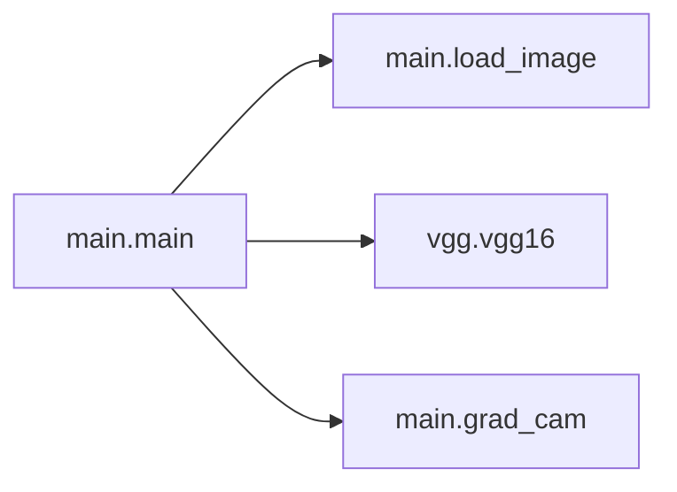

# Key Objects

[_Documentation generated by Documatic_](https://www.documatic.com)

<!---Documatic-section-main.load_image-start--->
## main.load_image

<!---Documatic-section-load_image-start--->
<!---Documatic-block-main.load_image-start--->
<details>
	<summary><code>main.load_image</code> code snippet</summary>

```python
def load_image(img_path):
    print('Loading image')
    img = imread(img_path, mode='RGB')
    img = imresize(img, (224, 224))
    x = np.expand_dims(img, axis=0)
    x = x[:, :, :, ::-1]
    return (x, img)
```
</details>
<!---Documatic-block-main.load_image-end--->
<!---Documatic-section-load_image-end--->

# #
<!---Documatic-section-main.load_image-end--->

<!---Documatic-section-main.main-start--->
## main.main

<!---Documatic-section-main-start--->


### Object Calls

* main.load_image
* vgg.vgg16
* main.grad_cam

<!---Documatic-block-main.main-start--->
<details>
	<summary><code>main.main</code> code snippet</summary>

```python
def main(_):
    (x, img) = load_image(FLAGS.input)
    sess = tf.Session()
    print('\nLoading Vgg')
    imgs = tf.placeholder(tf.float32, [None, 224, 224, 3])
    vgg = vgg16(imgs, 'vgg16_weights.npz', sess)
    print('\nFeedforwarding')
    prob = sess.run(vgg.probs, feed_dict={vgg.imgs: x})[0]
    preds = np.argsort(prob)[::-1][0:5]
    print('\nTop 5 classes are')
    for p in preds:
        print(class_names[p], prob[p])
    predicted_class = preds[0]
    layer_name = FLAGS.layer_name
    nb_classes = 1000
    cam3 = grad_cam(x, vgg, sess, predicted_class, layer_name, nb_classes)
    img = img.astype(float)
    img /= img.max()
    new_img = img + 3 * cam3
    new_img /= new_img.max()
    io.imshow(new_img)
    plt.show()
    io.imsave(FLAGS.output, new_img)
```
</details>
<!---Documatic-block-main.main-end--->
<!---Documatic-section-main-end--->

# #
<!---Documatic-section-main.main-end--->

<!---Documatic-section-main.grad_cam-start--->
## main.grad_cam

<!---Documatic-section-grad_cam-start--->
<!---Documatic-block-main.grad_cam-start--->
<details>
	<summary><code>main.grad_cam</code> code snippet</summary>

```python
def grad_cam(x, vgg, sess, predicted_class, layer_name, nb_classes):
    print('Setting gradients to 1 for target class and rest to 0')
    conv_layer = vgg.layers[layer_name]
    one_hot = tf.sparse_to_dense(predicted_class, [nb_classes], 1.0)
    signal = tf.mul(vgg.layers['fc3'], one_hot)
    loss = tf.reduce_mean(signal)
    grads = tf.gradients(loss, conv_layer)[0]
    norm_grads = tf.div(grads, tf.sqrt(tf.reduce_mean(tf.square(grads))) + tf.constant(1e-05))
    (output, grads_val) = sess.run([conv_layer, norm_grads], feed_dict={vgg.imgs: x})
    output = output[0]
    grads_val = grads_val[0]
    weights = np.mean(grads_val, axis=(0, 1))
    cam = np.ones(output.shape[0:2], dtype=np.float32)
    for (i, w) in enumerate(weights):
        cam += w * output[:, :, i]
    cam = np.maximum(cam, 0)
    cam = cam / np.max(cam)
    cam = resize(cam, (224, 224))
    cam3 = np.expand_dims(cam, axis=2)
    cam3 = np.tile(cam3, [1, 1, 3])
    return cam3
```
</details>
<!---Documatic-block-main.grad_cam-end--->
<!---Documatic-section-grad_cam-end--->

# #
<!---Documatic-section-main.grad_cam-end--->

[_Documentation generated by Documatic_](https://www.documatic.com)